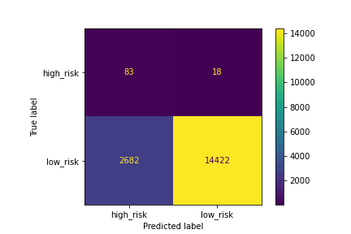
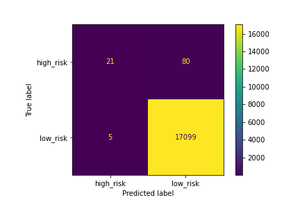

# Credit_Risk_Analysis

##Overview of the analysis: The purpose of this Analysis is to show accuracy score

Results: An accuracy score for the model was calculated.

**ClusterConfusion**
- An accuracy score for the model was calculated as 0.996

**RandomOverSampler**
- An accuracy score for the model was calculated as  0.833

**SMOOTEEN** 
- An accuracy score for the model was calculated as 0.844

**SMOTE**
- An accuracy score for the model was calculated as  0.844

## Summary:  recommendation on the model to use (https://imbalanced-learn.org/stable/index.html). 